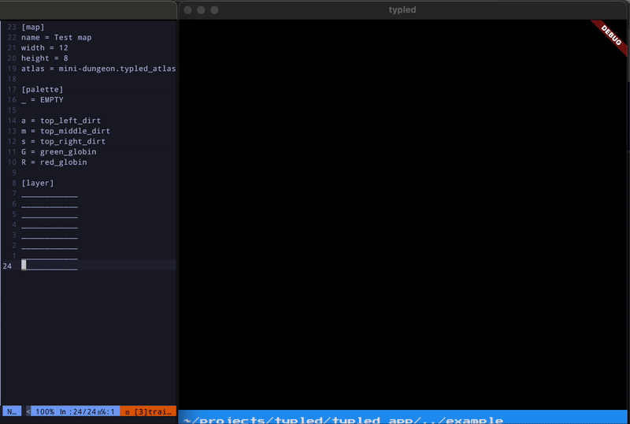

# Typled

Typled is a text based map tool. It uses a simple format where characters are mapped to a texture.

The "position" of the character in the text is used to determine the position of the
texture in the map.

Creating typled maps is just editing a simple text file, so users can choose any text editors
they like.

A simple CLI is also provided, which allow users to install and use the previewer app, which
shows the rendered map in a simple desktop application.



To install the CLI, run:

```bash
dart pub global activate typled_cli
```

Typled currently supports:
 - Individual maps with multiple layers
 - Grid of maps, where each map is a cell in the grid
 - Out of the box Texture Atlas format
 - [Fire Atlas textures format](https://docs.flame-engine.org/latest/bridge_packages/flame_fire_atlas/fire_atlas.html).

 For more information check out the [docs](./docs/README.md).
